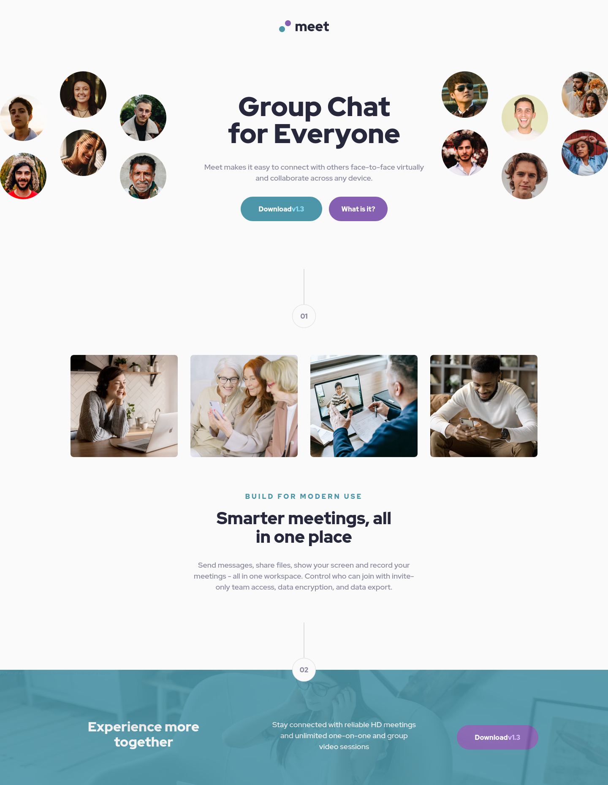

# Frontend Mentor - Meet landing page solution

This is a solution to the [Meet landing page challenge on Frontend Mentor](https://www.frontendmentor.io/challenges/meet-landing-page-rbTDS6OUR). Frontend Mentor challenges help you improve your coding skills by building realistic projects.

## Table of contents

- [Frontend Mentor - Meet landing page solution](#frontend-mentor---meet-landing-page-solution)
  - [Table of contents](#table-of-contents)
  - [Overview](#overview)
    - [The challenge](#the-challenge)
    - [Screenshot](#screenshot)
    - [Links](#links)
  - [My process](#my-process)
    - [Built with](#built-with)
    - [What I learned](#what-i-learned)
    - [Continued development](#continued-development)
  - [Author](#author)

**Note: Delete this note and update the table of contents based on what sections you keep.**

## Overview

### The challenge

Users should be able to:

- View the optimal layout depending on their device's screen size
- See hover states for interactive elements

### Screenshot

### Links

- Solution URL: [Solution](https://github.com/metrikspacex/meet-landing-page)
- Live Site URL: [Site]([https://metrikspacex.github.io/meet-landing-page/](https://metrikspacex-meet-landing-page.netlify.app/)

## My process

### Built with

- Semantic HTML5 markup
- CSS custom properties
- Flexbox
- CSS Grid
- Mobile-first workflow
- [Angular](https://angular.io/) - Typescript Framework

**Note: These are just examples. Delete this note and replace the list above with your own choices**

### What I learned

- Using mixins more efficiently
- Creating a base mixin, and utility classes in it. Targeting those for breakpoints.

### Continued development

- responsive images
- reusable components
- planning out components
- managing multiple components in working with each other

## Author

- Frontend Mentor - [@metrikspacex](https://www.frontendmentor.io/profile/metrikspacex)
